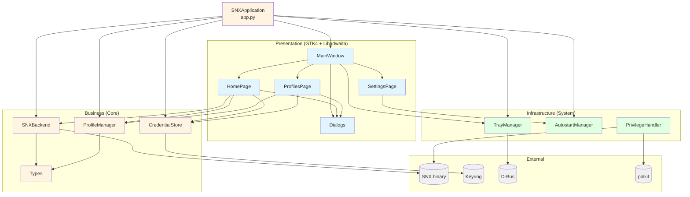

# SNX VPN — Architecture Documentation

**Project:** snxui v0.1.0 — GUI client for Check Point SNX VPN on Linux
**Generated:** 2026-02-28
**Language:** Python 3.10+
**UI Toolkit:** GTK4 + Libadwaita

---

## Architecture Pattern

**Layered architecture** with three internal layers and an external dependency boundary:

| Layer | Color | Contents |
|-------|-------|----------|
| Presentation | light blue | GTK4 + Libadwaita windows, pages, dialogs |
| Business | light yellow | VPN automation, profile CRUD, credential storage |
| Infrastructure | light green | D-Bus tray (SNI), XDG autostart, polkit |
| External | gray | SNX binary, keyring, D-Bus session bus, polkit |

---

## Quick Overview

---

## Files in This Directory

### Specifications

| File | Description |
|------|-------------|
| [`overview.yaml`](overview.yaml) | Full architecture specification: components, layers, data flows, storage, quality attributes, key decisions |

### Diagrams

| File | Description |
|------|-------------|
| [`diagrams/dependency-graph.md`](diagrams/dependency-graph.md) | Component and module dependency graphs (Mermaid) |
| [`diagrams/data-flow-connect.md`](diagrams/data-flow-connect.md) | VPN connect, disconnect, and unexpected-drop sequence diagrams |
| [`diagrams/data-flow-startup.md`](diagrams/data-flow-startup.md) | Application startup and single-instance guard flowcharts |

---

## Component Summary

### Business Layer

| Component | File | Role |
|-----------|------|------|
| `SNXApplication` | `snxui/app.py` | Orchestrates all services; GTK lifecycle |
| `SNXBackend` | `snxui/core/snx_backend.py` | pexpect PTY automation; connection monitor thread |
| `ProfileManager` | `snxui/core/profile_manager.py` | CRUD on `~/.config/snxui/profiles.json`; atomic writes |
| `CredentialStore` | `snxui/core/credential_store.py` | Keyring abstraction; in-memory fallback |
| `types` | `snxui/core/types.py` | `Profile`, `ConnectionStatus`, `ConnectionState` |

### Presentation Layer

| Component | File | Role |
|-----------|------|------|
| `MainWindow` | `snxui/ui/main_window.py` | Three-page ViewStack; GAction registration; tray wiring |
| `HomePage` | `snxui/ui/home_page.py` | Connect/disconnect UI; background thread + GLib.idle_add |
| `ProfilesPage` | `snxui/ui/profiles_page.py` | Profile list, add/edit/delete with confirmation dialog |
| `SettingsPage` | `snxui/ui/settings_page.py` | Autostart toggle, minimize-to-tray, color scheme |
| `Dialogs` | `snxui/ui/dialogs.py` | `PasswordDialog`, `ProfileDialog`, `AboutDialog` |

### Infrastructure Layer

| Component | File | Role |
|-----------|------|------|
| `TrayManager` | `snxui/system/tray_manager.py` | D-Bus StatusNotifierItem (SNI) tray icon |
| `AutostartManager` | `snxui/system/autostart.py` | XDG autostart `.desktop` file management |
| `PrivilegeHandler` | `snxui/system/privilege_handler.py` | pkexec + polkit privilege escalation for SNX |

---

## Key Design Decisions

1. **pexpect for SNX** — SNX requires an interactive TTY for password input; pexpect spawns it in a pseudo-TTY without requiring root for the GUI process.

2. **StatusNotifierItem D-Bus tray** — AppIndicator3 is GTK3-only and GNOME 40+ drops it. SNI is the cross-desktop standard supported by GNOME (extension), KDE Plasma (native), and XFCE.

3. **filelock + threading.Lock** — Profiles file is guarded by both an in-process threading.Lock and a cross-process filelock.FileLock to handle multiple simultaneous GUI instances.

4. **polkit privilege escalation** — Running the GUI as root is a security anti-pattern. A dedicated `com.snxui.connect` polkit action allows a single privileged SNX invocation with a desktop authentication dialog.

5. **Passwords in OS keyring only** — Passwords never appear in `profiles.json`. libsecret / KDE Wallet provide secure OS-managed storage with access control.

---

## Data Storage

| Path | Format | Owner | Notes |
|------|--------|-------|-------|
| `~/.config/snxui/profiles.json` | JSON | ProfileManager | No passwords; atomic write via .tmp + rename |
| `~/.config/autostart/snxui.desktop` | XDG Desktop Entry | AutostartManager | Created when autostart enabled |
| `~/.local/share/snxui/snxui.log` | Plain text | logging | Created on first run |
| OS keyring | native | CredentialStore | Keyed as `profile:{uuid}` under service `snxui` |
| `/usr/share/polkit-1/actions/com.snxui.policy` | XML | system package | polkit action for root SNX invocation |

---

## Threading Model

The application is single-threaded for GTK/GLib but uses two daemon thread patterns:

- **Connect/disconnect thread** — `HomePage._do_connect()` and `_do_disconnect()` spawn a daemon thread for the blocking pexpect operations. Results post back via `GLib.idle_add()`.
- **Monitor thread** (`snxui-monitor`) — Started by `SNXBackend` after a successful connect. Polls the `tunsnx` interface every 5 seconds to detect unexpected tunnel loss. Stopped on disconnect.

All `SNXBackend` internal state mutations occur under `threading.Lock`. `ProfileManager` uses both `threading.Lock` and `filelock.FileLock`.
