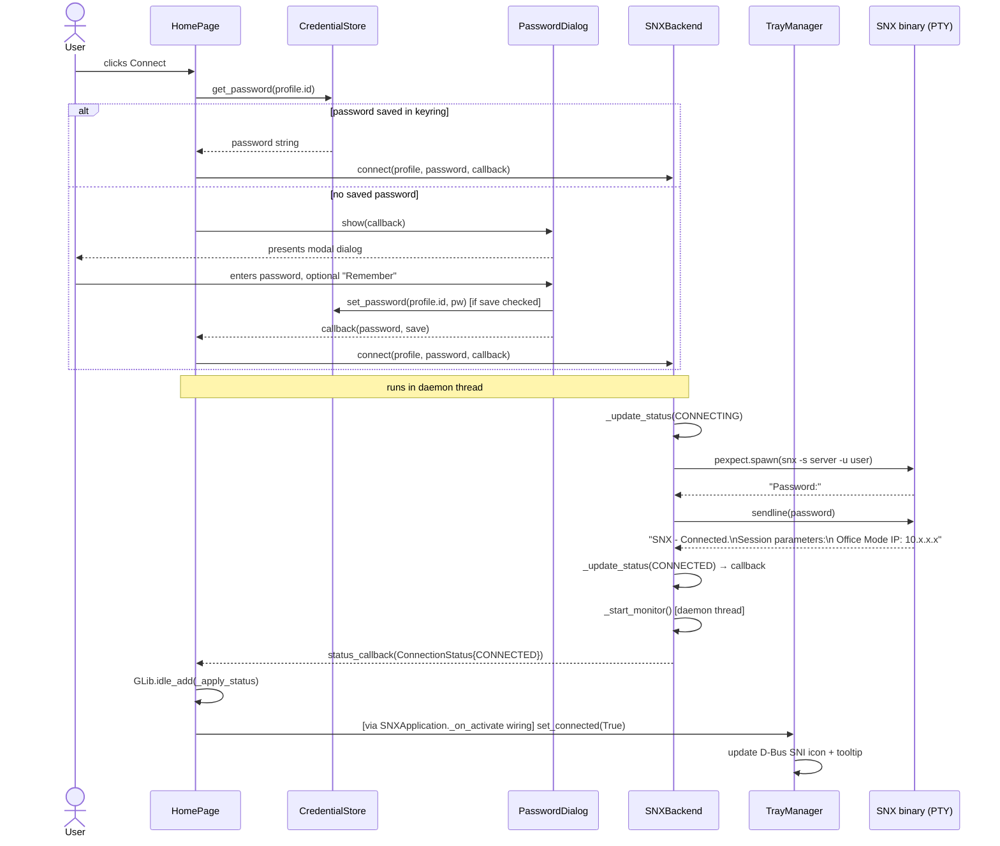
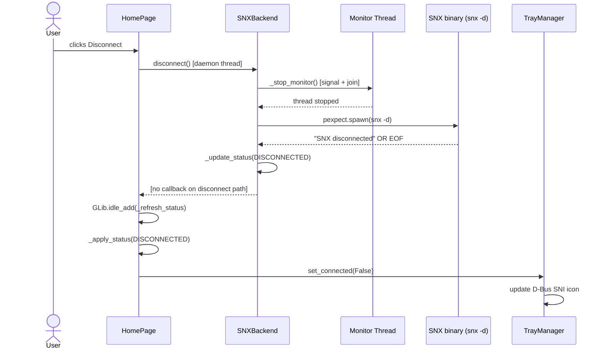
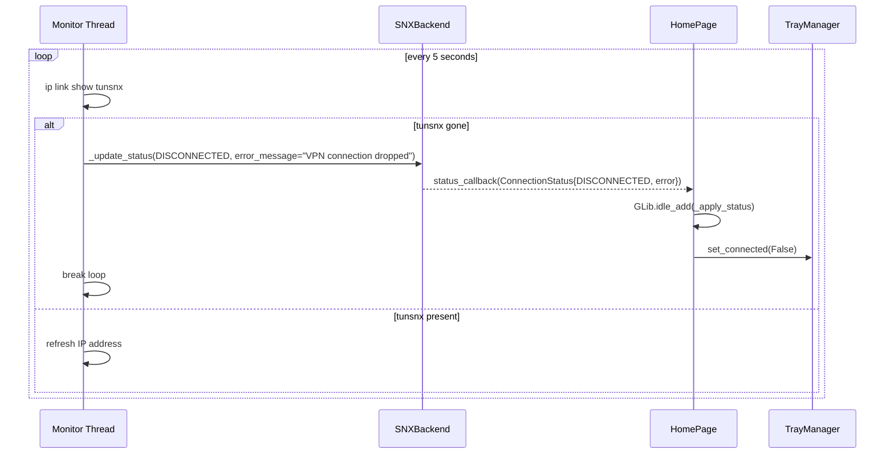

# Data Flow — VPN Connect / Disconnect

Generated: 2026-02-28

## Connect Flow

```mermaid
sequenceDiagram
    actor User
    participant HP as HomePage
    participant CS as CredentialStore
    participant DL as PasswordDialog
    participant SB as SNXBackend
    participant TM as TrayManager
    participant SNX as SNX binary (PTY)

    User->>HP: clicks Connect
    HP->>CS: get_password(profile.id)
    alt password saved in keyring
        CS-->>HP: password string
        HP->>SB: connect(profile, password, callback)
    else no saved password
        HP->>DL: show(callback)
        DL-->>User: presents modal dialog
        User->>DL: enters password, optional "Remember"
        DL->>CS: set_password(profile.id, pw) [if save checked]
        DL-->>HP: callback(password, save)
        HP->>SB: connect(profile, password, callback)
    end

    Note over HP,SB: runs in daemon thread

    SB->>SB: _update_status(CONNECTING)
    SB->>SNX: pexpect.spawn(snx -s server -u user)
    SNX-->>SB: "Password:"
    SB->>SNX: sendline(password)
    SNX-->>SB: "SNX - Connected.\nSession parameters:\n  Office Mode IP: 10.x.x.x"
    SB->>SB: _update_status(CONNECTED) → callback
    SB->>SB: _start_monitor() [daemon thread]

    SB-->>HP: status_callback(ConnectionStatus{CONNECTED})
    HP->>HP: GLib.idle_add(_apply_status)
    HP->>TM: [via SNXApplication._on_activate wiring] set_connected(True)
    TM->>TM: update D-Bus SNI icon + tooltip
```

## Disconnect Flow

```mermaid
sequenceDiagram
    actor User
    participant HP as HomePage
    participant SB as SNXBackend
    participant MON as Monitor Thread
    participant SNX as SNX binary (snx -d)
    participant TM as TrayManager

    User->>HP: clicks Disconnect
    HP->>SB: disconnect() [daemon thread]

    SB->>MON: _stop_monitor() [signal + join]
    MON-->>SB: thread stopped

    SB->>SNX: pexpect.spawn(snx -d)
    SNX-->>SB: "SNX disconnected" OR EOF
    SB->>SB: _update_status(DISCONNECTED)
    SB-->>HP: [no callback on disconnect path]

    HP->>HP: GLib.idle_add(_refresh_status)
    HP->>HP: _apply_status(DISCONNECTED)
    HP->>TM: set_connected(False)
    TM->>TM: update D-Bus SNI icon
```

## Unexpected Disconnect (Monitor Detection)

```mermaid
sequenceDiagram
    participant MON as Monitor Thread
    participant SB as SNXBackend
    participant HP as HomePage
    participant TM as TrayManager

    loop every 5 seconds
        MON->>MON: ip link show tunsnx
        alt tunsnx gone
            MON->>SB: _update_status(DISCONNECTED, error_message="VPN connection dropped")
            SB-->>HP: status_callback(ConnectionStatus{DISCONNECTED, error})
            HP->>HP: GLib.idle_add(_apply_status)
            HP->>TM: set_connected(False)
            MON->>MON: break loop
        else tunsnx present
            MON->>MON: refresh IP address
        end
    end
```
