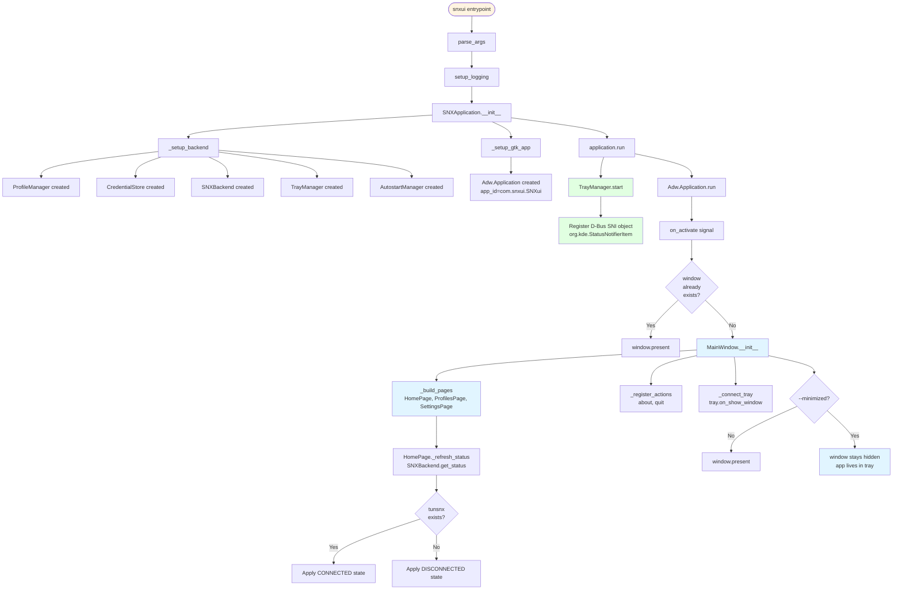
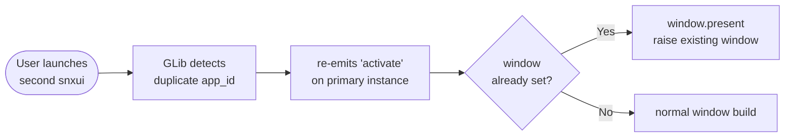

# Data Flow — Application Startup

Generated: 2026-02-28

## Normal Startup (`snxui`) and Minimized Startup (`snxui --minimized`)

```mermaid
flowchart TD
    START([snxui entrypoint]) --> ARGS[parse_args]
    ARGS --> LOG[setup_logging]
    LOG --> NEW[SNXApplication.__init__]

    NEW --> BACKEND[_setup_backend]
    BACKEND --> PM[ProfileManager created]
    BACKEND --> CS[CredentialStore created]
    BACKEND --> SB[SNXBackend created]
    BACKEND --> TM[TrayManager created]
    BACKEND --> AM[AutostartManager created]

    NEW --> GTK[_setup_gtk_app]
    GTK --> ADW[Adw.Application created\napp_id=com.snxui.SNXui]

    NEW --> RUN[application.run]
    RUN --> TRAY_START[TrayManager.start]
    TRAY_START --> DBUS_REG[Register D-Bus SNI object\norg.kde.StatusNotifierItem]

    RUN --> GRUN[Adw.Application.run]
    GRUN --> ACTIVATE[on_activate signal]

    ACTIVATE --> WINCHECK{window\nalready\nexists?}
    WINCHECK -- Yes --> PRESENT[window.present]
    WINCHECK -- No --> WINBUILD[MainWindow.__init__]

    WINBUILD --> PAGES[_build_pages\nHomePage, ProfilesPage, SettingsPage]
    WINBUILD --> ACTIONS[_register_actions\nabout, quit]
    WINBUILD --> TRAY_WIRE[_connect_tray\ntray.on_show_window]

    PAGES --> STATUS[HomePage._refresh_status\nSNXBackend.get_status]
    STATUS --> TUNSNX{tunsnx\nexists?}
    TUNSNX -- Yes --> CONNECTED_INIT[Apply CONNECTED state]
    TUNSNX -- No --> DISC_INIT[Apply DISCONNECTED state]

    WINBUILD --> MINCHECK{--minimized?}
    MINCHECK -- No --> WINSHOW[window.present]
    MINCHECK -- Yes --> HIDDEN[window stays hidden\napp lives in tray]

    style START fill:#fff4e1
    style TRAY_START fill:#e1ffe1
    style DBUS_REG fill:#e1ffe1
    style WINBUILD fill:#e1f5ff
    style PAGES fill:#e1f5ff
    style HIDDEN fill:#e1f5ff
```

## Single-Instance Guard

```mermaid
flowchart LR
    SECOND([User launches\nsecond snxui]) --> GLIB[GLib detects\nduplicate app_id]
    GLIB --> RELAY[re-emits 'activate'\non primary instance]
    RELAY --> GUARD{window\nalready set?}
    GUARD -- Yes --> PRESENT2[window.present\nraise existing window]
    GUARD -- No --> BUILD2[normal window build]
```
