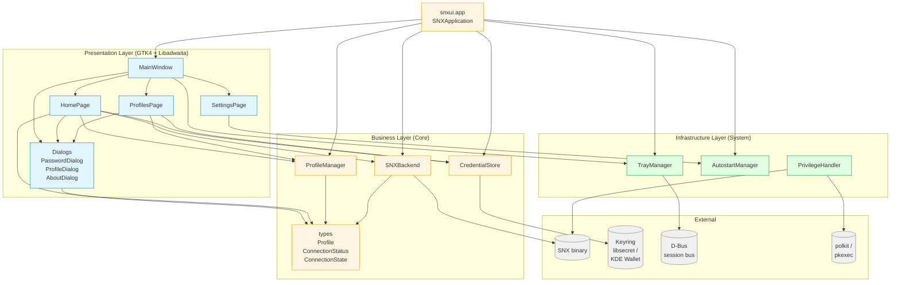
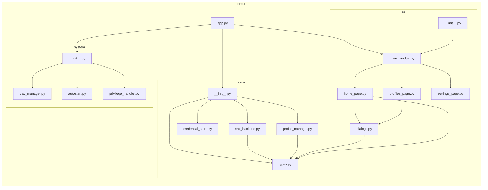

# SNX VPN — Component Dependency Graph

Generated: 2026-02-28

## Full Architecture

## Layer Legend

| Color | Layer | Responsibility |
|-------|-------|----------------|
| Light blue `#e1f5ff` | Presentation | GTK4 + Libadwaita UI widgets |
| Light yellow `#fff4e1` | Business | Domain logic, VPN automation, persistence |
| Light green `#e1ffe1` | Infrastructure | OS integration (D-Bus, XDG, polkit) |
| Gray `#f0f0f0` | External | Processes and OS services owned outside the app |

## Module-level Dependencies

